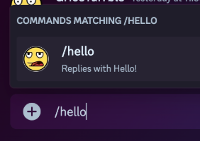

# Anatomy of a Discord Bot

So you've done all the [setup steps](getting_started.md)
and your bot is running smoothly. Great!

This doc goes into more detail about how discord.py bots do their thing,
with an additional focus on the _why_ for some common software patterns.

## So, how, um... how does it work?

To answer that, let's look at the source code for this bot, which isn't much.

In fact, here's the whole thing
(at least, the original `src/disbot/__init__.py` from this template):

```py
import os

import discord
from discord.ext import commands
from dotenv import load_dotenv

load_dotenv()

DISCORD_TOKEN = os.getenv("DISCORD_TOKEN", "")
DISCORD_GUILD = int(os.getenv("DISCORD_GUILD", "0"))

intents = discord.Intents.default()
intents.message_content = True
bot = commands.Bot(command_prefix="!", intents=intents)


@bot.event
async def on_ready():
    await bot.tree.sync(guild=discord.Object(id=DISCORD_GUILD))
    print(f"Logged in as {bot.user} (ID: {bot.user.id})")


@bot.tree.command(
    description="Replies to /hello",
    guild=discord.Object(id=DISCORD_GUILD),
)
async def hello(interaction: discord.Interaction):
    """Just say hello."""
    print("Responding to /hello")
    await interaction.response.send_message("Hello, how are you?")


@bot.command(description="Replies to !whatsup")
async def whatsup(ctx):
    """Just say hello."""
    print("Responding to !whatsup")
    await ctx.send("Nothing much")


def main():
    """Run the bot."""
    bot.run(DISCORD_TOKEN)
    print("Shutting down.")


if __name__ == "__main__":
    main()
```

The source code may seem complex,
especially for newcomers to Discord bots, Python, or programming in general.
Let's look at each part the above code in more detail, one piece at a time.

### Environment variable handling

Per the [Twelve-Factor App method](https://12factor.net/),
we prefer to [store config in the environment](https://12factor.net/config).
This means all parts of the _configuration_ of the app -
including any secrets like our Discord app token and which server/guild to connect to -
should be separate from the _code_ of that app.
This reduces the possibility of accidentally committing a token to a public repo,
as well as making it easier to start the app with a different configuration
without needing to make changes to the actual code of the app.

Now, remember our `.env` file created during the [bootstrap step](getting_started.md#bootstrap-environment) in setup?
It may look something like this:

```sh
DISCORD_TOKEN=superSecretTokenValue12345 #(1)
DISCORD_GUILD=678910
```

1. If this is your real token value, please contact Discord support and tell them something is very, very wrong.

Now have a look at this section of our code:

```py
from dotenv import load_dotenv

load_dotenv()

DISCORD_TOKEN = os.getenv("DISCORD_TOKEN", "") #(1)
DISCORD_GUILD = int(os.getenv("DISCORD_GUILD", "0"))
```

1. This second argument is a default value, returned if the environment variable is not present at all.
   You can read this as "return the value of `DISCORD_TOKEN` if it is present, otherwise return an empty string".

   If this default were missing, it would return `None`.
   It may still be useful to use `None` in some contexts, of course.

   Or, maybe you want the whole program to crash if the environment variable is missing
   (yes, sometimes that's a good thing!).
   In which case, consider simply calling `os.environ["KEY"]`, which will throw an exception
   if that environment variable is missing.

The `load_dotenv()` function
(from the [`python-dotenv`](https://pypi.org/project/python-dotenv/) package)
reads the contents of that `.env` file.
Each line is parsed into an [environment variable](https://en.wikipedia.org/wiki/Environment_variable)
in the form `name=value`.

Next, [`os.getenv()`](https://docs.python.org/3/library/os.html#os.getenv)
can be used to pull a given value from the environment.
In our case, we want to grab our `DISCORD_TOKEN` and our `DISCORD_GUILD` values,
storing these in variables

!!! info "One option out of many"

    `load_dotenv()` is not required for `os.getenv()` to function;
    the former is simply a helper method for loading the `.env` file's contents.
    You could just as easily set these environment variables in other ways,
    such as on the command line when running the program:

    ```sh
    # Set an environment variable inline when starting the program:
    DISCORD_GUILD=678910 uv run disbot

    # Setting a variable ahead of time with `export`:
    export DISCORD_GUILD=678910
    uv run disbot
    ```

    Explore your use case and decide how you want these values set in your own environment.

### Defining the bot

Next we come to this bit of code, which creates our `bot` object:

```py
# Recall where these imports came from:
import discord
from discord.ext import commands

intents = discord.Intents.default()
intents.message_content = True
bot = commands.Bot(command_prefix="!", intents=intents)
```

#### Intents

The `intents` parameter is used to define
[Gateway Intents](https://discordpy.readthedocs.io/en/stable/intents.html)
for our bot.
These allow a bot to subscribe to specific events and ignore others.

The [default intents](https://discordpy.readthedocs.io/en/stable/api.html#discord.Intents.default)
provide most of the events you need, but not those considered "privileged",
such as presence and message content.
This is why we are explicitly setting `intents.message_content = True` above,
so that the bot is able to read the contents of a message in order to know
whether it should respond to a command from one.

!!! warning

    You must *also* set the Message Content intent within the
    [Discord Developer portal],
    as shown in the [permissions setup](getting_started.md#setup-intents-and-permissions).

#### Command prefix

The
[`command_prefix`](https://discordpy.readthedocs.io/en/stable/ext/commands/api.html#discord.ext.commands.Bot.command_prefix),
as the name implies, is the prefix expected for standard commands to the bot.
For instance, if we have a command called `foo` with a prefix of `!`,
the bot will respond when `!foo` is at the start a user's message.

### Handling events

Next we come to this little bit here:

```py
@bot.event
async def on_ready():
    await bot.tree.sync(guild=discord.Object(id=DISCORD_GUILD))
    print(f"Logged in as {bot.user} (ID: {bot.user.id})")
```

[`@bot.event`](https://discordpy.readthedocs.io/en/stable/ext/commands/api.html#discord.ext.commands.Bot.event)
registers an event listener, with the event matching the name of the function
(in this case, the `on_ready` event, which fires sometime at the start of the bot application,
though this timing is not always guaranteed).
More details on which events are available can be found
[here](https://discordpy.readthedocs.io/en/stable/api.html#discord-api-events).

The main purpose for our use case is to
[sync the command tree](https://discordpy.readthedocs.io/en/stable/interactions/api.html#discord.app_commands.CommandTree.sync),
which updates the server(s) our bot is connected to
with any changes that may have occurred for our Slash Commands.
Without these, changes in our code may not be reflected within Discord,
and attempting to send one of those commands will throw an exception in our bot
(with an unhelpful error message shown in Discord).

Aside from that, we're simply printing that the bot user logged in successfully.
This may seem trivial, but having that feedback can be handy,
confirming that the right app account was used for this program.

!!! question "How should I handle logging?"

    As you may have noticed, we're just using simple `print` calls in this template,
    though a proper logging config would be ideal.
    By default, not much activity is logged to the console from a discord.py app,
    so you're pretty much on your own here.

    Well, not entirely on your own.
    [discord.py has some advice](https://discordpy.readthedocs.io/en/stable/logging.html)
    on logging;
    [Python's `logging` module](https://docs.python.org/3/library/logging.html#module-logging)
    has some interesting recipes, as well.
    And there are many great third-party libraries such as
    [loguru](https://loguru.readthedocs.io/en/stable/overview.html) and
    [structlog](https://www.structlog.org/en/stable/) to choose from.

    Which logging strategy you choose is outside the scope of this document.
    As a general rule, though, I would advise following
    [Twelve Factor's advice on Logs](https://12factor.net/logs):
    have the app send logs, unbuffered, to `stdout`.

    For now, `print()` will suffice :slight_smile:.

### Adding a slash command

Now let's get to the good part: an actual command!

We'll start with a
[Slash Command](https://support-apps.discord.com/hc/en-us/articles/26501837786775-Slash-Commands-FAQ).
Typing `/` into the chat shows us Slash Commands available in the server,
and we can either type it or click on it in the pop-up menu:



Defining one is a simple matter of adding a new method to the bot's "command tree":

```py
@bot.tree.command(
    description="Replies to /hello",
    guild=discord.Object(id=DISCORD_GUILD),
)
async def hello(interaction: discord.Interaction):
    """Just say hello."""
    print("Responding to /hello")
    await interaction.response.send_message("Hello, how are you?")
```

- The name of the command, `hello`, is taken from the name of the coroutine we are decorating.
  Alternatively, we could set a `name="blah"` parameter in the
  [`@bot.tree.command` decorator](https://discordpy.readthedocs.io/en/stable/interactions/api.html#discord.app_commands.CommandTree.command)
  to change the name to something else.

- Our `description`, as we see above, is shown to the user when they are selecting our command from the menu.

- `guild` is optional, but in this case we use the `DISCORD_GUILD` environment variable from earlier
  to only permit the command to work on _that_ server.

The coroutine itself (`async def hello()`) takes at least one argument,
[`interaction`](https://discordpy.readthedocs.io/en/stable/interactions/api.html#discord.Interaction),
which we can use to respond back to the user who send this command.
This object also contains information about the channel the sent the command in,
the server, the roles of the user, and so on.

We use this `interaction` to send a
[`response`](https://discordpy.readthedocs.io/en/stable/interactions/api.html#discord.InteractionResponse),
in this case a simple
[`send_message`](https://discordpy.readthedocs.io/en/stable/interactions/api.html#discord.InteractionResponse.send_message)
call with the text `"Hello, how are you?"`:


!!! tip "Way more than just a text message"

    That's a lengthy explanation for a pretty simple interaction,
    but those details open the door to many possibilities:

    - responding with a message that can contain one or more
    [embeds](https://discordpy.readthedocs.io/en/stable/api.html#discord.Embed),
    [files](https://discordpy.readthedocs.io/en/stable/api.html#discord.File),
    or even a [poll](https://discordpy.readthedocs.io/en/stable/api.html#discord.Poll).
    - editing a previous message that was sent
    - adding a reaction to a post
    - checking the roles of a user to see if they are even permitted to *use* this command

    I invite you to explore the
    [`Interaction`](https://discordpy.readthedocs.io/en/stable/interactions/api.html#discord.Interaction)
    object and its associated attributes in more detail
    to discover what you might want to do with your Slash command.

#### Adding arguments

Having a simple `/hello` command is all well and good,
but what if we want it to announce "Hello" to a friend of ours?

We can simply add a new argument to our command and update the logic a bit, like so:

```diff
@bot.tree.command(
    description="Replies to /hello",
    guild=discord.Object(id=DISCORD_GUILD),
)
-async def hello(interaction: discord.Interaction):
+async def hello(interaction: discord.Interaction, name: str):
    """Just say hello."""
    print("Responding to /hello")
-   await interaction.response.send_message(f"Hello, how are you?")
+   await interaction.response.send_message(f"Hello {name}, how are you?")
```

Now, simply shut down the running bot with `Ctrl-C` and restart it
(`uv run disbot` or `just up` again).
This reconnects the bot with the Discord API and, in our case,
calls `bot.tree.sync()` within the `on_ready` event,
updating the server with the changes to our command.

Once we see the `Logged in...` message in the console,
we can be sure the bot is updated,
and so we can now run our updated command:


We can type a name within this prompt in Discord:


...and our command receives the string `"Stanley"` as the `name` argument,
which it then uses in the response:


### Adding a standard command

Bots can read message content from a chat channel, then interpret a message as a "command".
While Slash Commands are a relatively newer addition to Discord,
these types of "standard" commands have been around for a long time.
And, while they are less discoverable than Slash Commands,
they do not require syncing a tree with the server before the bot can respond.
Instead, the bot just watches all messages to see if one is a "command" that it should act on.

In discord.py, writing one of these commands is about as simple as writing a Slash Command:

```py
@bot.command(description="Replies to !whatsup")
async def whatsup(ctx):
    """Just say hello."""
    print("Responding to !whatsup")
    await ctx.send("Nothing much")
```

Recall that our bot is configured with the `command_prefix` value of `"!"`.
This means the bot will look for messages that _start_ with the phrase `!whatsup`
(matching the name of the coroutine above) and respond by sending a message to the channel:


Notice how this is a simple message sent to the channel
(using [`ctx.send`](https://discordpy.readthedocs.io/en/stable/ext/commands/api.html?highlight=context#discord.ext.commands.Context.send)),
not a reply to the user sending the command.
To do that, we can use
[`ctx.reply`](https://discordpy.readthedocs.io/en/stable/ext/commands/api.html?highlight=context#discord.ext.commands.Context.reply)
instead:

```diff
@bot.command(description="Replies to !whatsup")
async def whatsup(ctx):
    """Just say hello."""
    print("Responding to !whatsup")
-   await ctx.send("Nothing much")
+   await ctx.reply("Nothing much")
```


As with Slash Commands, these commands can also take arguments:

```diff
@bot.command(description="Replies to !whatsup")
-async def whatsup(ctx):
+async def whatsup(ctx, name: str):
    """Just say hello."""
    print("Responding to !whatsup")
-   await ctx.reply("Nothing much")
+   await ctx.reply(f"Nothing much, {name}!")
```

However, where the Slash Command arguments create a container for the user to enter the arg value,
standard commands will split the message on spaces and pass individual words to different args:


Check the [discord.py Command Parameters doc](https://discordpy.readthedocs.io/en/stable/ext/commands/commands.html#parameters)
for more details on this behavior, how to use a variable number of parameters, and so on.

!!! tip "Tip of the iceberg"

    As with Slash Commands, there are many more possibilities for what a command can do.
    The `ctx` parameter
    (a [`Context`](https://discordpy.readthedocs.io/en/stable/ext/commands/api.html#discord.ext.commands.Context) instance)
    contains loads of information about the user sending the command, the channel where it was sent,
    the contents of their [message](https://discordpy.readthedocs.io/en/stable/api.html#discord.Message),
    whether they were replying to someone else, and so on.

### Running the bot

Finally, we have the part that actually starts our bot.
Without it, the program would _define_ the bot and these commands just fine,
but then it would immediately shut down, doing nothing!

Starting the bot is a simple matter of calling
[`bot.run`](https://discordpy.readthedocs.io/en/stable/ext/commands/api.html#discord.ext.commands.Bot.run)
with our `DISCORD_TOKEN` passed in to authenticate it.
In our template, we have a little extra wrapped around that call:

```py
def main():
    """Run the bot."""
    bot.run(DISCORD_TOKEN)
    print("Shutting down.")


if __name__ == "__main__":
    main()
```

- The `main()` function - not a coroutine! - is our entrypoint for the program.
  It's not required for any Python to have a function by this name
  (some other languages _do_ require a specific `main` method defined as the entrypoint),
  but it's a solid pattern.
- `if __name__ == "__main__":`, if you're unfamiliar with it,
  is a guard statement that prevents some code from running automatically if this module is ever imported.
  There's a great explanation for the use of this guard in [this SO answer](https://stackoverflow.com/a/419185).
  We use it here as the point where `main()` is actually being _called_, in order to start the program.
- `bot.run()` starts the event loop in discord.py, connecting to the Discord API
  and handling sessions, authentication, etc.
  Within our `main()` function, the control flow mostly stays inside this line of code.
- Whenever the bot shuts down
  (such as when you press ++ctrl+c++ in the terminal to stop it),
  the event loop in `bot.run` exits, and the last line, `print("Shutting down")`,
  will finally run. After this, the program exits naturally.

[Discord Developer Portal]: https://discord.com/developers/applications
